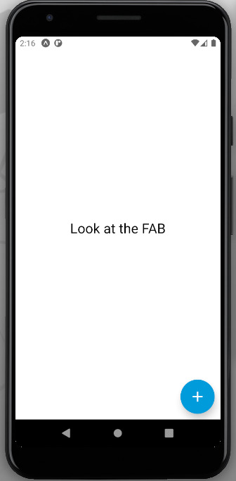
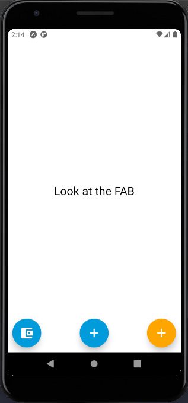

# @lucasmrc435/rn-fab

React Native _**Floating Action Button**_


# Install

Using npm 

```
npm install @lucasmrc435/rn-fab --save
```

Using yarn

```
yarn add @lucasmrc435/rn-fab
``` 

# Import 

```javascript
import FloatingActionButton from '@lucasmrc435/rn-fab'
```

# Usage

```javascript
    <FloatingActionButton 
    color="orange" 
    onPress={() => {
        console.log("FAB Pressed!");
    }}
    />
```

# Example
```javascript
import React from 'react';
import { View, Text } from 'react-native';

import FloatingActionButton from '@lucasmrc435/rn-fab'

const App = () => {
    return (
        <View> 
              <Text>Look at the FAB</Text>

              <FloatingActionButton 
                color="orange" 
                onPress={() => {
                    console.log("FAB Pressed!");
                }}
                />

                <FloatingActionButton 
                position="center"
                onPress={() => {
                    console.log("FAB Pressed!");
                }}
                />
                
                <FloatingActionButton 
                position="left"
                icon="wallet" 
                onPress={() => {
                    console.log("FAB Pressed!");
                }}
                />
        <View>
    );
}
```




# Props

| Property | Type | Default | Description|
|----------|------|---------|------------|
| color    | String  | #049bdb | FAB's Color|
| position | String  | ```right```  | FAB's position|
| icon     | String  | ```plus``` | FAB's Icon|
| iconColor| String  | white | Icon's Color|
| OnPress    | Function  | null | FAB's onPress function|


## ```color``` 
The color that will fill the FAB. Any color of StyleSheets and CSS

type : ```String```

## ```position```
The FAB's position. Position can only be ```left``` | ```center``` | ```right```

type : ```String```


## ```icon```
The Icon that will appear inside the FAB. Any Icon from [MaterialCommunityIcons](https://materialdesignicons.com/)

type : ```String```

## ```iconColor```
The color that will fill the FAB's Icon

type : ```String```

## ```onPress```
The function that is called when the button is activated.

type : ```Void Function```